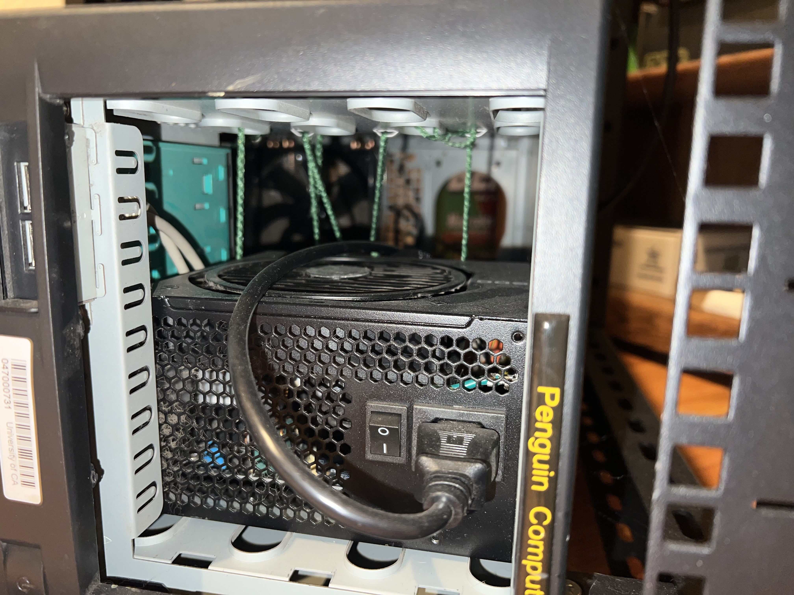
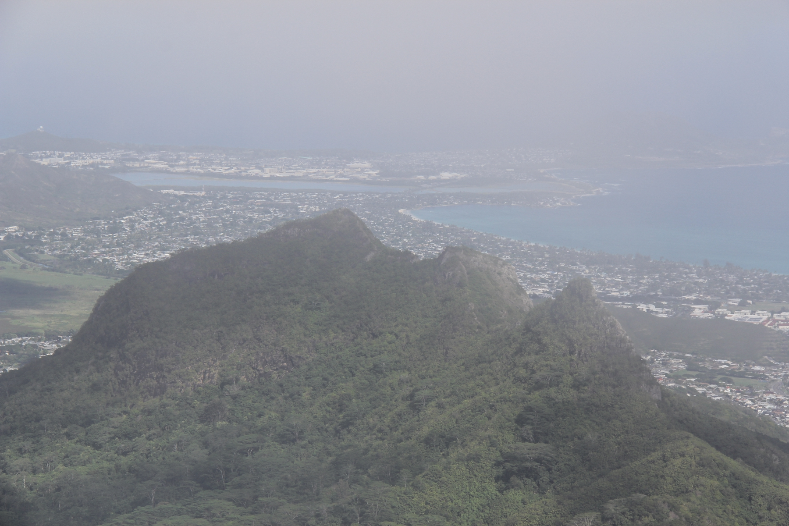

[PWS](https://whitney.rip) is a homelabbing project that has taught me much about Linux, hardware, networking, and security practices. I use it to host a variety of self-created projects, open source software, and anything that piques my interest.

The v1 implementation of PWS was named Whitney, after the mountain in California. The original hardware was sourced from my old desktop PC, which was made completely of hand-me-down parts, and was housed in an old server case that was e-wasted by my college. This initial build was definitely on the "janky" side, featuring an unmounted power supply in the optical bay, secured only by some green yarn. (Fire hazard, anyone?)

 
I ran a lot of services from this box - my personal website/online resume, side projects, a Covid-19 data tracker, game servers, and a lot of other projects that taught me lessons in DNS config, networking, maintaining persistent storage and others.
But eventually I started running up against the limits of the box. The machine's CPU was released in 2008, which was indicative of the age of most of its hardware. After spending a lot of work on the original Whitney config in the first repo, I decided that I had learned enough to warrant an upgrade.
The v2 upgrade to PWS was given the nickname of "Olomana", a second step in this pattern of mountainous server names. Mount Olomana is a mountain on the windward side of Oahu. It has 3 peaks which are are a popular, albeit difficult and dangerous hike. While visiting family in Kailua, I hiked the Ko'olau range and snapped this picture of the rarely seen backside of Mount Olomana.

Olomana, the web server, is a significant upgrade over its predecessor. I've built it as a 4U rack-mounted machine with modern components. It's now mounted in a 16U rack, with a UPS and mesh network node close by. Critical resources like RAM and CPU cores are now a little more abundant, and I've set up the ZFS filesystem to provide redundancy against the power outages that occasionally would corrupt drive on the original PWS.

I'm super happy with the rebuild, and would encourage anyone with similar interests to jump in and give homelabbing a try for themselves.

See more on [Github](https://github.com/runyanjake/olomana).
