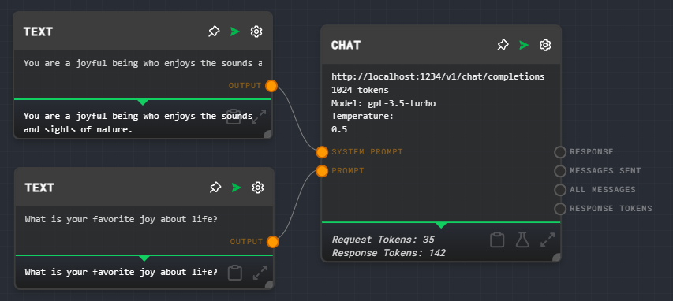
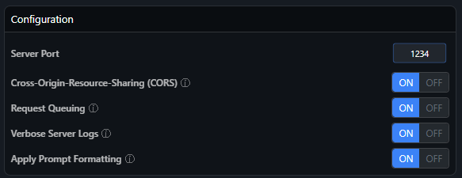

Like so many others, I've recently delved into the wonderful world of Large Language Models (LLMs) and Generative AI, and more importantly, into the most recent of self-hostable resources from various researchers and fellow hobbyists.

With both of these machine learning flavors spawning hordes of AI-driven startups as of late, I wanted to give things a shot on my own and see just how much tinkering is really needed to start producing something interesting.

I bring with me the concept of workflow being one of the most important factors of productivity. If the software devlopment process isn't streamlined, or your record->edit->upload pipeline for content creation has bottlenecks, your productivity takes a big hit.
The same is true here, so this is why I've looked through FOSS projects for a good way to build myself an LLM pipeline.

## What do we want?

An ideal pipeline for me allows me to
- Switch the models in use on demand
- Change the "business logic" of the pipeline on demand
- Interface from code or hook into other services, in case i decide to productize something

Luckily others think like me, so we are luckily blessed with LLMStudio. This allows me to explore different models, hot swap them in, quickly test them, and most importantly, start them as an api which conforms to the OpenAI api format.

When looking for a frontend for my pipeline, I tried a few things but ultimately felt like a lot of software was angled toward working directly with OpenAI resources and other AIaaS solutions that require api keys. Not a lot of them supported the self-hosted option.
Eventually I found Rivet, and it has been a good solution so far. It is happy to support anything that looks like OpenAI's api format, so we are good to go.

What follows is a short tutorial for a POC of my LLM pipeline.

## Tutorial

1. Install Rivet and LLM Studio (links below)

2. Launch Rivet and begin a new Graph.
Add a simple flow with text nodes leading into a Chat node, and the output being dumped into a Graph Output node.

Running this gives an error because there's no OpenAI credentials, but we'll be running locally so that's not a problem.

3. In LM Studio, go to the Search tab and find a model. In the example I search for Mistral and find `mistral-7b-instruct-v0.1.Q2_K.gguf`. Download it to somewhere you've got space, these are large!
The model should show up in the "My Models" tab.

4. Open the "Local Server" tab and in the top bar, load your model.

Leave the configuration alone EXCEPT for enabling CORS, which allows us to connect from other origins (e.g. through curl).

5. Click Start Server and confirm things are working by copying the curl given as an example. You will need to allow LM Studio through your computer's firewall.

You should see console output confirming things work.

6. Back in Rivet, configure the Chat node.
In GPT Model, choose "Local Model".
In Advanced, put in the endpoint pointing to LM Studio. This would be the endpoint ending in /v1/chat/completions.

IMPORTANTLY, DO NOT flip the switch to the right unless you plan to explicitly add your endpoint in as a node on the map.

7. Click run in the top right to generate an output.

## Resources

[Rivet Project Page](https://rivet.ironcladapp.com/)

[LM Studio Project Page](https://lmstudio.ai/)

[Reference Video](https://www.youtube.com/watch?v=vyzNkWYIcac)

