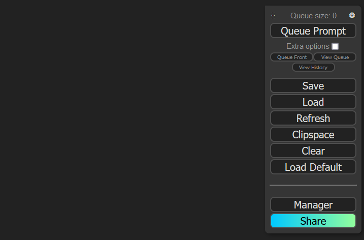
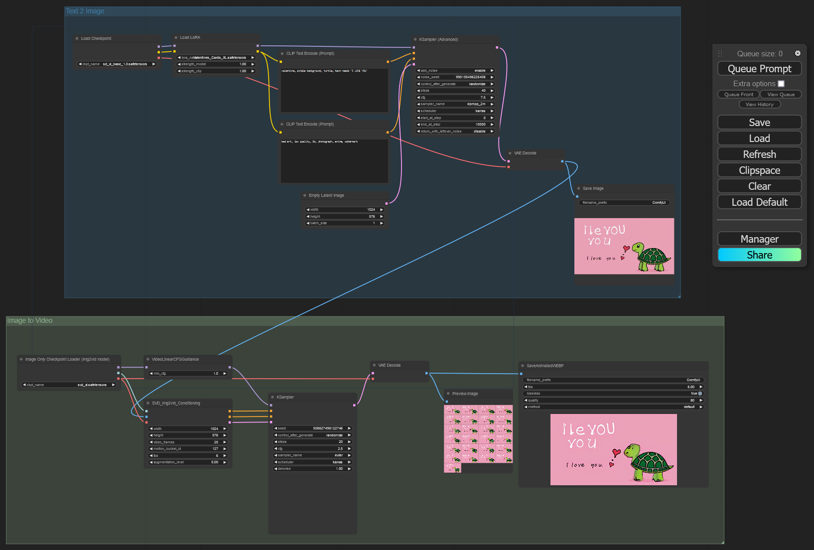

Stable Diffusion is a fun way to experience AI. For someone exploring the models that others create, it's important to have a streamlined workflow so that the bulk of time can be spent on experimentation rather than configuration.

I learned of Stable Diffusion XL in 2023 and wanted to find nice UI-based solution for doing this experimentation. ComfyUI has what I'm looking for. It's a commonly used tool now, and a lot of people contribute workflows, models, and fine tuning checkpoints. 

Here's how I work with it. 

## Setup

1. Clone the ComfyUI repo (link below).

2. In the ComfyUI folder, for Windows machines with Nvidia GPUs, run `run_nvidia_gpu.bat`. It starts a default project.

3. That's it! All further configuration depends on what you're plugging into it. 

## Using ComfyUI

You don't need to read it from me, ComfyUI has really thorough [examples](https://comfyanonymous.github.io/ComfyUI_examples/)! But here's what I typically do.

### Custom Models/Workflows/Fine Tuning 

CivitAI has custom workflows you can download that do certain things. You can import other workflows, or export your current setup to a workflow with the Save feature.
Sometimes workflows require custom nodes which have to be downloaded seperately. 

- There are custom model checkpoints that you can add to the `/ComfyUI/models/checkpoints` folder and use in the `Load Checkpoint` node. 
- There are custom fine-tuning weights called LoRAs that can be placed in the `/ComfyUI/models/loras` folder and used with the `Load LoRA` node.
- Also, you can download VAE weights, place in `/ComfyUI/models/vae` as well into some nodes.

Check out ComfyUI's examples for workflows you can download.

## Some Fun Examples!

1. Text to Image

The base SDXL workflow ([Base SDXL + Refiner](https://comfyanonymous.github.io/ComfyUI_examples/sdxl/)) is a pretty good way to generate images.

Fun fact, the images on the home page of this website were generated using this workflow, specifying just positive and negative prompts!
After image generation they were passed through [Adobe's SVG conversion tool](https://new.express.adobe.com/tools/convert-to-svg). 

2. Text to Image to Video

This flow is a combo of 2 examples. I'm using a model trained to generate valentines day cards! It has some problems with text but otherwise generates nice happy characters.
The image to video is best suited for photoreal images but does give us a little motion in the final result.

[CivitAi Link](https://civitai.com/models/298774/valentines-cards-xl-concept)

## Resources

[ComfyUI Page](https://github.com/comfyanonymous/ComfyUI)

[CivitAI Page](https://civitai.com/tag/sdxl)

