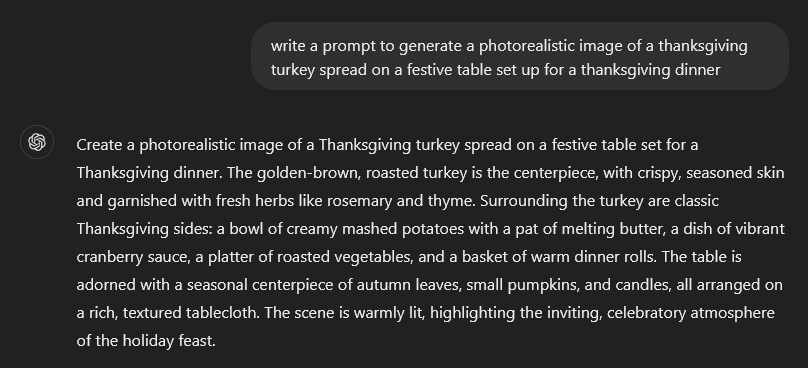
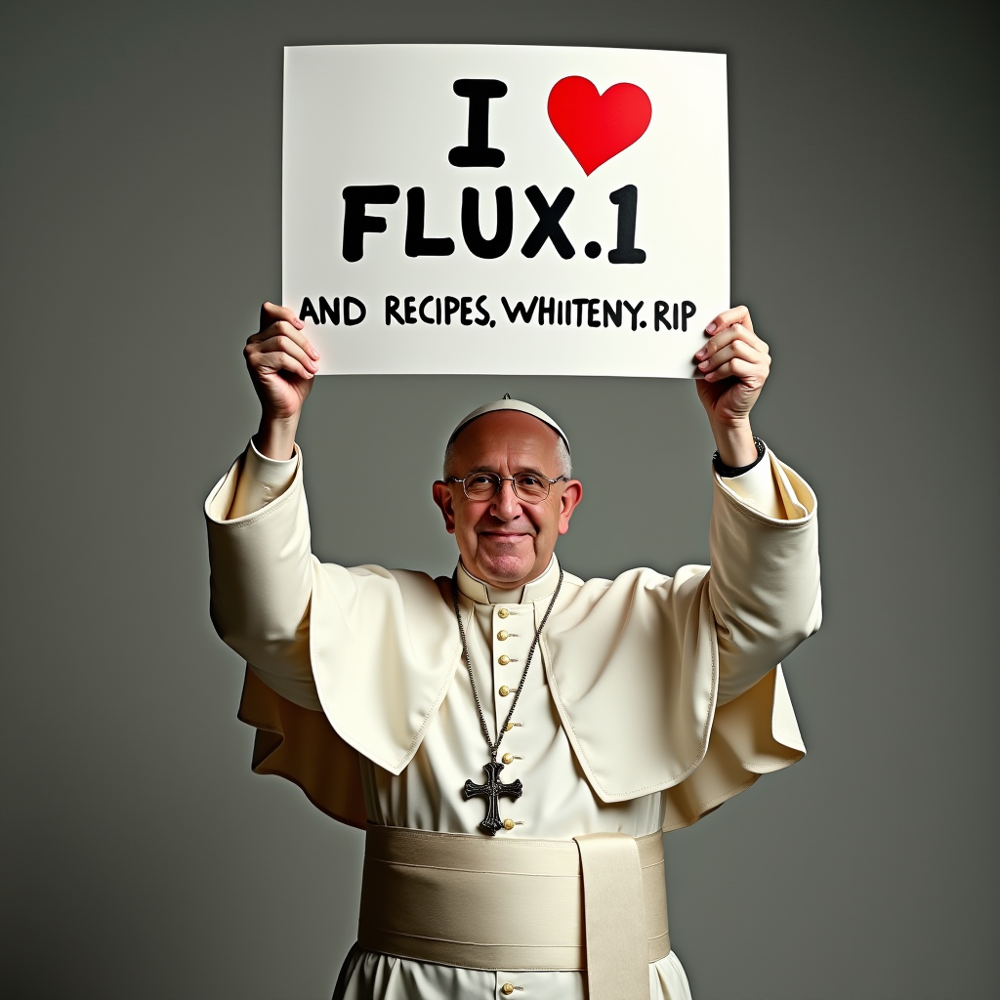
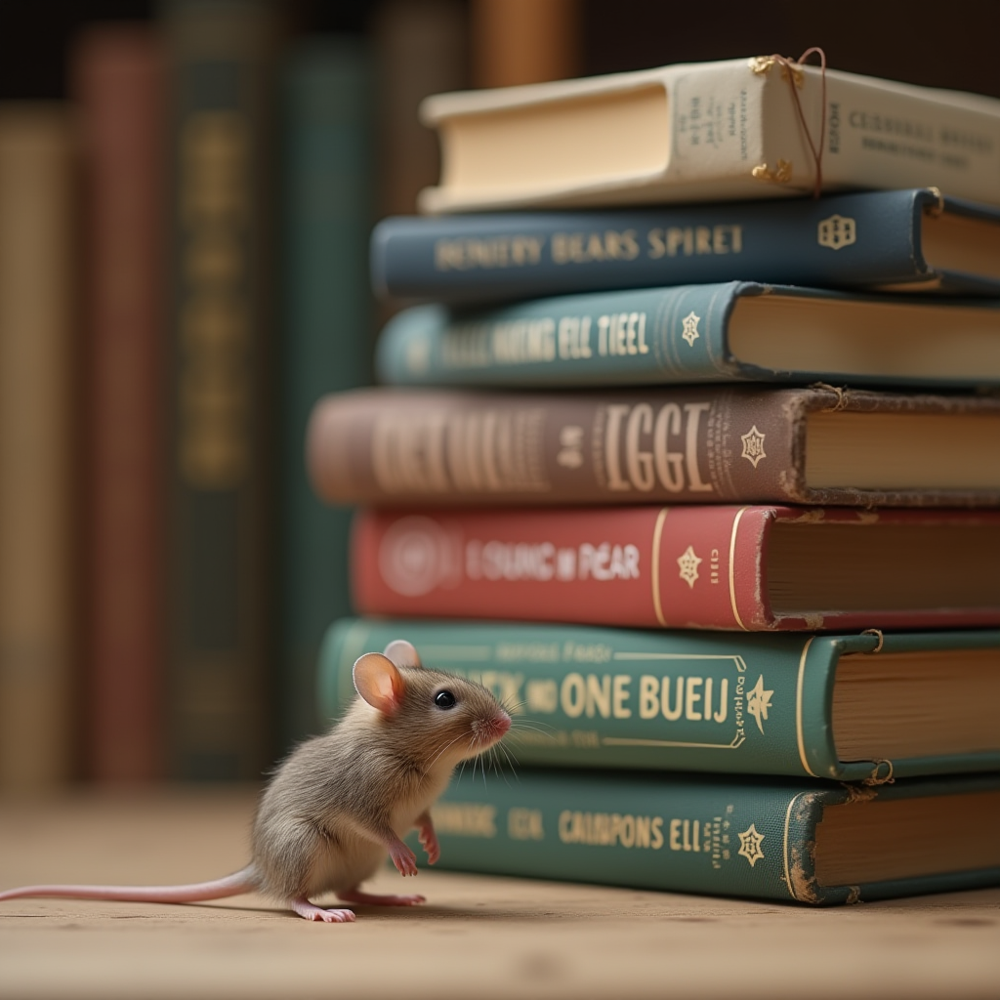
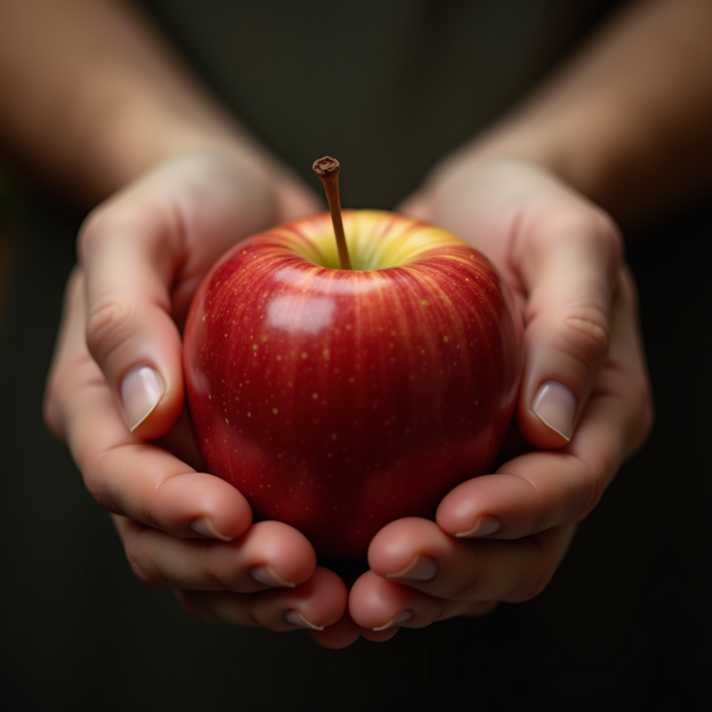

Stable diffusion and its peers have proven to be the beginning of the wide applications of image generation. Over the past year, AI-generated content has become a lot more prevalent on the internet, showing up everywhere from social media to content mill news sites.

In my last iteration of the [PWS Recipes site](https://recipes.whitney.rip), I used the recent release of SDXL in a ComfyUI pipeline to generate static content for the site.

Now, with the release of newer image generation model Flux, I go back for another stab at generating these images.

## Pipeline

Prompt generation is hard. Let's ironically use ChatGPT to generate a prompt for Flux.1.

The ComfyUI pipeline used is very simple. Just a single KSampler pass to generate the image.

And, we're done.

## Thoughts

So, obviously some things have improved since the last time I looked into this space, and others have not.

The most impressive leap forward has been in text generation, but that being said it's not always perfect:

In the past we had to do with specially trained models that typically generated text with a lot of errors, usually smashing together characters.
The current state of text generation is far better, the text that is specified in the prompt is treated specially and is correct more than it is incorrect.
Despite this, background text (anything that not generated as a result of explicitly asking for it in the prompt) frequently has some of the original issues we faced, but that can be worked around.

Other things that are better in this model include hands and feet - previously generating anything with exposed hands or feet would often end up looking more like a horror illustration, but now they look more humanlike than not.
There are still issues with multiple hands showing up where there should only be one, but there is a large improvement in getting the correct number of digits, and making them curl in the correct ways.
Overall, a great step forward!

One thing that hasn't seen much improvement is generating photos of eggs. For some reason whole peeled eggs haven't come out very well in my experience.

Overall, the steps are positive, and the release of new tools means we have new limits to push the boundaries of. 

## Resources

[Flux.1](https://flux1.io/)

[ComfyUI](https://github.com/comfyanonymous/ComfyUI)
