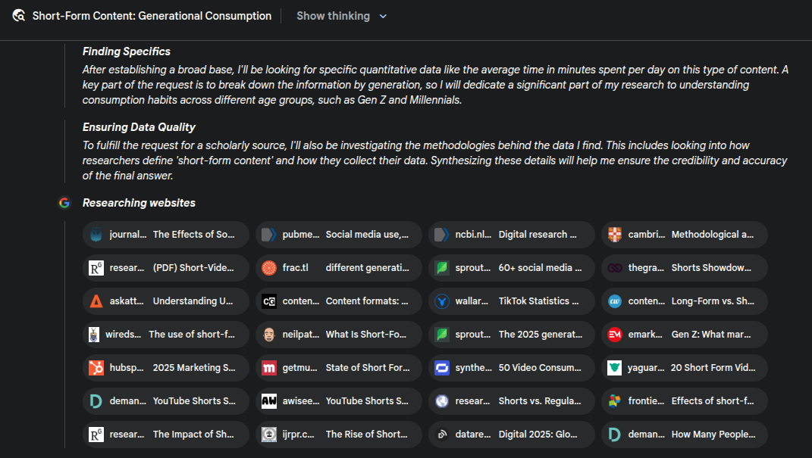
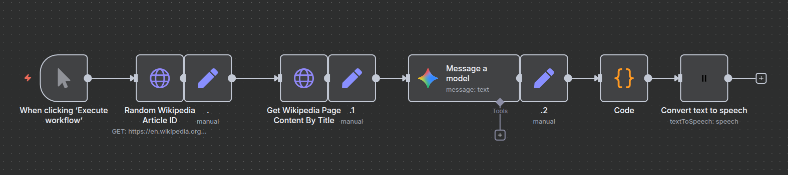
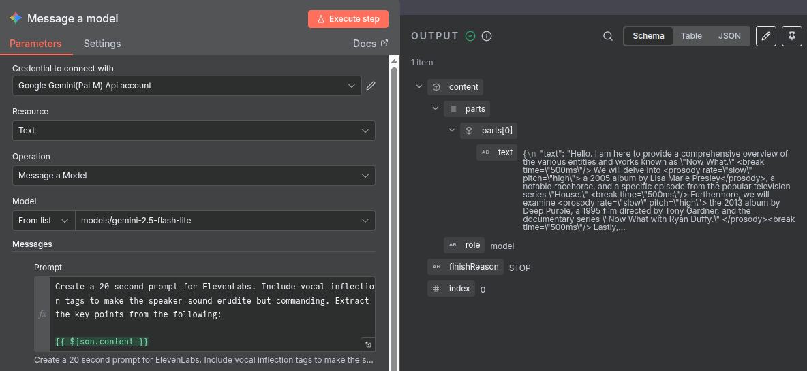
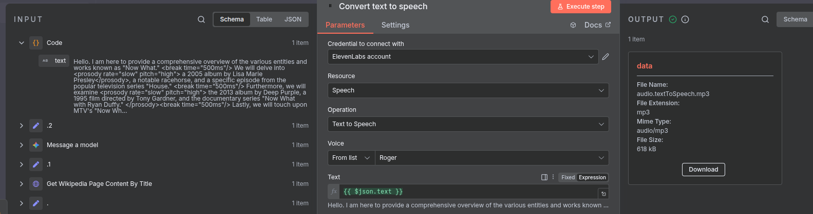
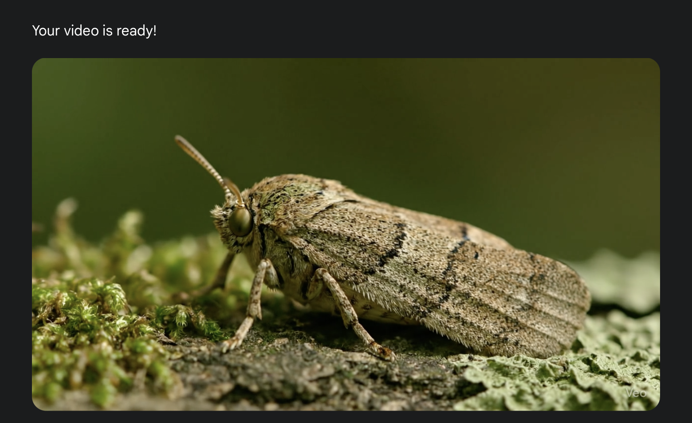

--- 
title: On AI Workflows
date: 2025-08-27
author: Jake Runyan
--- 

Well it might finally be the time where we make the [Dead Internet Theory](https://en.wikipedia.org/wiki/Dead_Internet_theory) into a reality. The working world at large has accepted that AI will be here to stay for tasks like design, summary, and review - but a looming issue is its applications for content generation, and what that's going to do to our chronically-online generations.

## If You Can't Beat Them 
A quick deep research session with Google's Gemini yields some stats about modern consumption of short form content.

The deep research session suggested between 6 and 9 hours daily average for screen time for the younger generations. Really crazy to see the averages be that high. I'm up there in terms of the numbers, but always figured that was a side effect of being interested in tech and the internet.

Half of this online time is attributed to social media, which, on the other hand, I have absolutely no problem accepting. I got on the short form content train around the time that the social media giants started rolling their own solutions to compete with TikTok. I've both produced content for my biking YouTube channel, and consumed a fair amount on those social platforms.

We're in a bit of what I'd describe as a "content boom", where changing incentive structures are driving us closer to this Dead Internet Theory. At some point long in the past, video content was generally thoughtful and well researched, using virality as merely a mechanism to improve reach. We've lost some of the thoughtfulness of our content, because only so much surface level data can exist in one TikTok, Short, or Reel, but the engagement and retention based reward systems are still the same.

Now that AI generated content is hitting the short form content landscape, it's a race to optimize the curves of cost (in time) and yield (in metrics that we'll be paid for). A decade ago, if you discovered a niche that got eyes, like dashcam footage, for example, you could execute on this vision but were limited by production time and effort. Need to cut research time? Easy, just have AI search for you. Want to scale? Automate your content generation. 

I'm seeing rigid form in some of the content served for to me, indicating that pipelines are already in place to monetize these gold nugget visions of engagement for all they're worth. And it makes me wonder how hard one of those is to set up. Spoiler: Not that hard. Get ready to never find a real piece of content again.

## Become Part of the Problem 
I usually catch up with these things after the open source community tooling goes through a few iterations. As of now in Q3 2025 we have tools like [N8N](https://n8n.io/), who deliver a workflow design experience, with a multitude of AI integrations so far.

My first problem is figuring out where content would come from. I could create a list of things that are interesting for me, but if we want to scale, it's gotta be automated.
I minimized cost a bit by not using Gen AI at every opportunity. I decided to use the Wikipedia API to get our content, which I learned follows the [MediaWiki Action API standard](https://www.mediawiki.org/wiki/API:Action_API). We're able to do some basic search and in addition search for random articles. This is my jumping off point for the pipeline, where I find a random article and use another endpoint to pull the full content.

Next we'll pass the content to an LLM. As our final output is audio, we'll add constraints for time, and include [Speech Synthesis Markup Language](https://en.wikipedia.org/wiki/Speech_Synthesis_Markup_Language) tags that [ElevenLabs](https://elevenlabs.io) uses to control voice inflection.    

Add in the convenient ElevenLabs node, and boom we have audio.

Finally, use something like Google's Veo to make a video and we're done - a simple FFMpeg script later to stitch things together and you have your next viral short.

I'm clearly not the first person to try something like this, as the tooling is... very simple to use. Quite worrying actually, as one person can generate enough content in a couple of minutes that might consume many more man-hours.

## Enough Grift Yet?
I thought of some more content pipelines.

"React" content is in a grey area where reposting videos with some sort of commentary is not really seen as copyright infringement. You could create another pipeline that receives a link to a video, uses video summary capabilities of AI to figure out what's going on, and generate a voice transcript. Stitch the two together and you have a ethically ambiguous piece of react content. 

## This is not good.
I didn't write this with AI, but boy would it have been easier - I'm not a journalist for a reason.

I still want to think about things when consuming content - I'm still a hopeful believer that the internet will remain primarily a tool to share knowledge and make cool things.
If we're just regurgitating the same stuff, what's the point?
